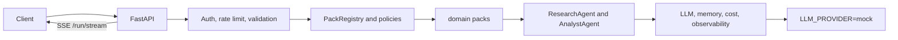

# agent-platform

Personal project by **Azizbek** ([azxav](https://github.com/azxav)).

A small multi-agent platform that runs with no API key.

FastAPI serves LangGraph domain packs as JSON or as Server-Sent Events. A pack registry picks the workflow. Each run is capped in USD. If a request repeats the same `Idempotency-Key`, the first response is replayed. Golden-dataset evals and the test suite both run against a deterministic mock model.

`financial_memo` is a sample/demo memo. HR and legal packs stay disabled (HTTP 403). This is not a bank system, not a hiring system, and not legal tech.

## Packs

| Pack | Route | Role |
|------|--------|------|
| `research_analysis` | `POST /run` and `POST /packs/research_analysis/run` | Default: research, then analysis |
| `meeting_prep` | `POST /packs/meeting_prep/run` | Meeting brief |
| `financial_memo` | `POST /packs/financial_memo/run` | Sample/demo strategy memo. The disclaimer is applied server-side |

Other productivity packs (`summariser`, `executive_brief`, `support_triage`, `rfp_assistant`) and the research phase splits stay registered so the kernel and evals have more than one shape. They are supporting examples.

HR (`talent_screening`, `job_description_writer`, `hr_policy_qa`) and legal (`contract_reviewer`) stay in the tree behind `REGULATED_PACKS_ENABLED=false`. A valid body returns **403**. Turning the flag on does not make them compliant.

## Run it (mock, no key)

Requirements: Python 3.12+ and [uv](https://docs.astral.sh/uv/getting-started/installation/).

```bash
git clone https://github.com/azxav/agent-platform.git
cd agent-platform
uv sync
cp .env.example .env          # LLM_PROVIDER=mock already
make run                      # http://localhost:8000
```

`.env.example` sets `LLM_PROVIDER=mock` and `SEARCH_PROVIDER=mock`. You do not fill in `ANTHROPIC_API_KEY` for this path.

```bash
# Health
curl -s http://localhost:8000/health

# Default research → analysis pipeline (SSE lives at /run/stream)
curl -s -X POST http://localhost:8000/run \
  -H "Content-Type: application/json" \
  -d '{"query": "What are the latest advances in quantum computing?"}'

curl -N -X POST http://localhost:8000/run/stream \
  -H "Content-Type: application/json" \
  -d '{"query": "What are the latest advances in quantum computing?"}'

# Registry
curl -s http://localhost:8000/packs

# Meeting brief
curl -s -X POST http://localhost:8000/packs/meeting_prep/run \
  -H "Content-Type: application/json" \
  -H "Idempotency-Key: demo-meeting-1" \
  -d '{"company": "Acme", "person": "Jane", "meeting_goal": "discovery"}'

# Sample finance memo (fictional). Look for the SAMPLE/DEMO disclaimer.
curl -s -X POST http://localhost:8000/packs/financial_memo/run \
  -H "Content-Type: application/json" \
  -d '{"topic": "Sample expansion memo", "hypothesis": "Illustrative only"}'
```

Interactive docs: `http://localhost:8000/docs` (off when `ENVIRONMENT=production`).

A real provider is optional. Set `LLM_PROVIDER` to `anthropic`, `openai`, `google`, `bedrock`, `azure`, or `ollama`, install the matching extra (`uv sync --extra anthropic`, and so on), and supply that provider's key. OpenRouter is only the generic `OPENAI_BASE_URL` override if you point the OpenAI client at a gateway. It is not configured here.

## Architecture



| Layer | Path | Role |
|-------|------|------|
| HTTP | `api/` | FastAPI, middleware, SSE, pack routes |
| Kernel | `pack_kernel/` | `BaseDomainPack`, `PackRegistry`, versions, traffic split |
| Workflows | `domain_packs/` | research, productivity, sample finance memo |
| Agents | `agents/` | Reusable LangGraph nodes |
| Policies | `control_plane/` | Query size, budget, human-review flags |
| Foundation | `core/` | Config, mock LLM, memory, cost, metrics |
| Ops | `infra/` | Dockerfile, Compose, Helm chart, Prometheus and Grafana |

`core/graph.py` is a compatibility shim onto `research_analysis`.

`GET /packs` and `GET /packs/{id}/versions` list registered versions. `X-Pack-Version` pins one. Weights split traffic.

## API

| Method | Path | What it does |
|--------|------|----------------|
| `GET` | `/health`, `/ready` | Probes |
| `GET` | `/packs` | Registered packs, versions, weights |
| `POST` | `/packs/{pack_id}/run` | Typed pack run |
| `POST` | `/packs/{pack_id}/run/stream` | Same run as SSE |
| `POST` | `/run`, `/run/stream` | Legacy aliases of `research_analysis` |
| `GET` | `/metrics` | Prometheus, after `uv sync --extra observability` |

Budget overrun: **402**. Idempotency clash: **409**. Disabled HR/legal pack: **403**. Bad body: **422**.

The same `Idempotency-Key` caches a completed pack response. The same key with a different body returns **409**.

## Cost cap

`PACK_DEFAULT_BUDGET_USD` (see `.env.example`) is the per-run ceiling. The cost tracker prices tokens from `core/cost.py`. Mock runs still report a `cost_usd` so the 402 path is testable without a paid model. Set a tiny budget if you want to see the rejection:

```bash
PACK_DEFAULT_BUDGET_USD=0.0000001 LLM_PROVIDER=mock uv run uvicorn api.main:app
```

## Evals and tests

```bash
make test     # pytest. No paid key. The suite sets a dummy Anthropic key so provider-construction tests stay offline.
make eval     # golden datasets, scripted responses, pass/fail printed by the harness
make eval-ci  # same gate as CI: JSON plus evals/thresholds.yaml
```

`LLM_PROVIDER=mock` is the default. CI and `make eval` do not need a provider key.

Datasets that ship today: `research_analysis`, `meeting_prep`, `financial_memo`, `summariser`, and `talent_screening` (the last one checks the fail-closed guard). `evals/datasets/*.yaml` replay scripted model output through the real pack code. `make eval` prints the pass counts. Those numbers are structural (schema, fields, guards). The pass rate is not a quality score for a live model.

## Docker and Helm

```bash
cp .env.example .env
docker compose -f infra/docker-compose.yml up --build
```

The image defaults to `LLM_PROVIDER=mock`. Compose reads `.env`.

Prometheus and Grafana:

```bash
docker compose -f infra/docker-compose.yml --profile observability up --build
```

`GET /metrics` is wired when the `observability` extra is installed. Dashboard JSON is under `infra/grafana/dashboards/` (cost, latency, pack versions).

Helm chart: `infra/helm/langgraph-agent-stack`. `values.yaml` sets `llm.provider` to `mock`.

```bash
helm lint infra/helm/langgraph-agent-stack
```

MIT. Upstream: [Brescou/langgraph-agent-stack](https://github.com/Brescou/langgraph-agent-stack).
